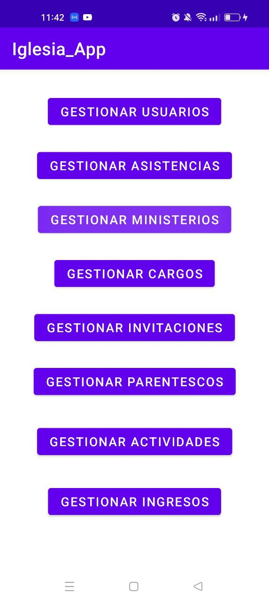
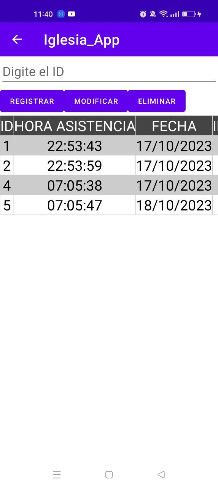
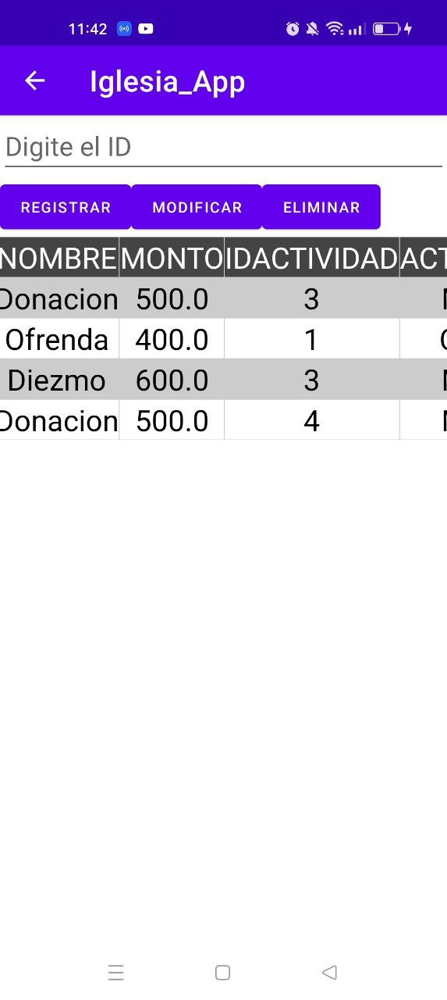
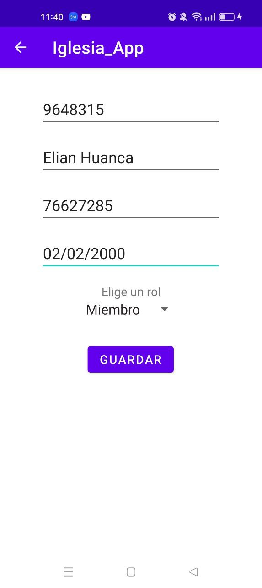
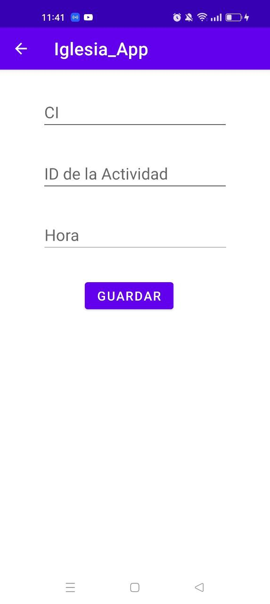
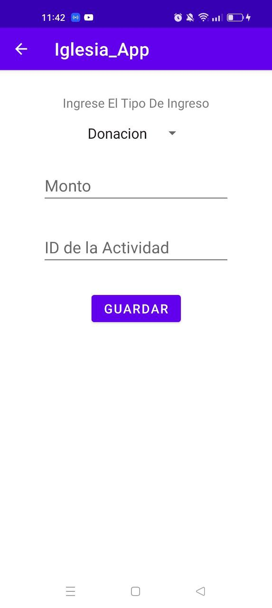

# Church Activity Management Mobile Application

[English](./README.md) | [Spanish](./README.es.md)

This is a mobile application developed with Java in Android Studio to manage information related to church activities using practical methods where the MVC architecture is applied.

## Main Features

- **User Management**: Allows registration and management of church member information.

- **Attendance Registration**: Records the attendance of church members at various activities.

- **Activity Scheduling**: Enables scheduling of church activities.

- **Income Registration**: Records the collections made at each activity conducted by the church.

## Screenshots

| **Dashboard** | **Attendance List** | **Income List** |
|:-------------------:|:--------------------------:|:----------------:|
|  |  |  |

| **User Form** | **Activity Form** | **Income Form** |
|:-----------------------:|:---------------------------------:|:--------------------------------------:|
|  |  |  |
